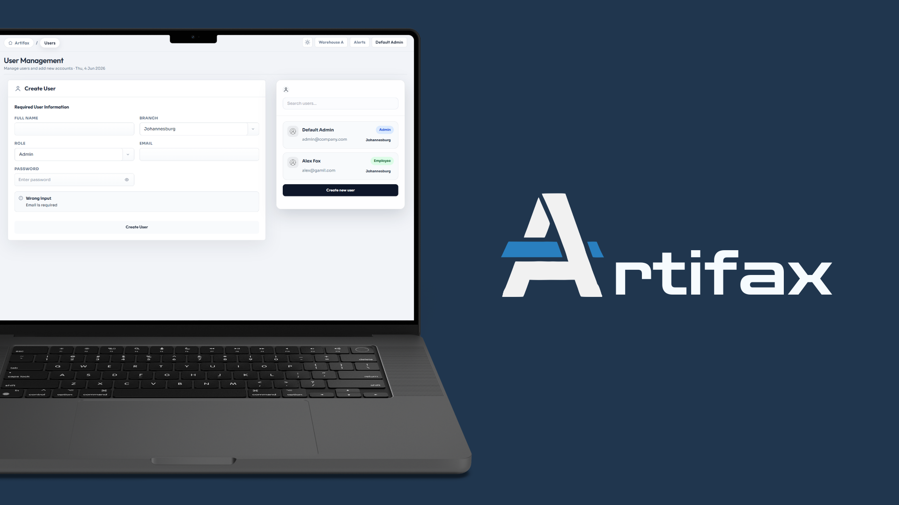
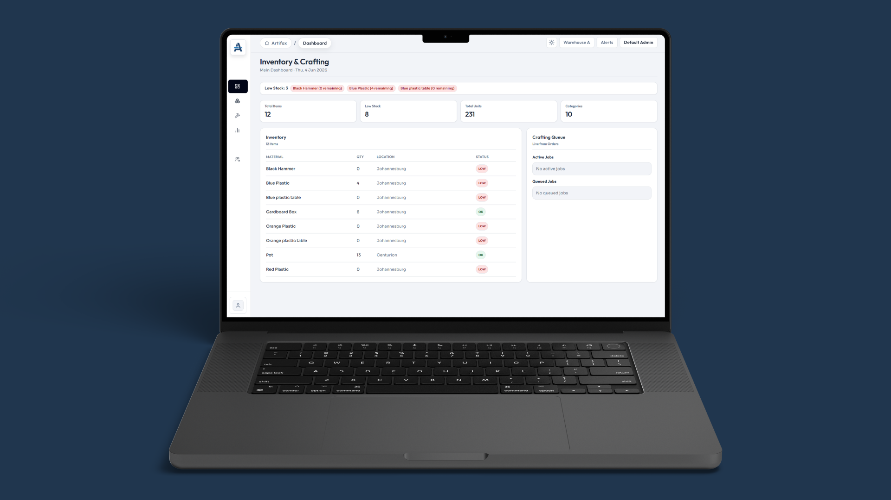
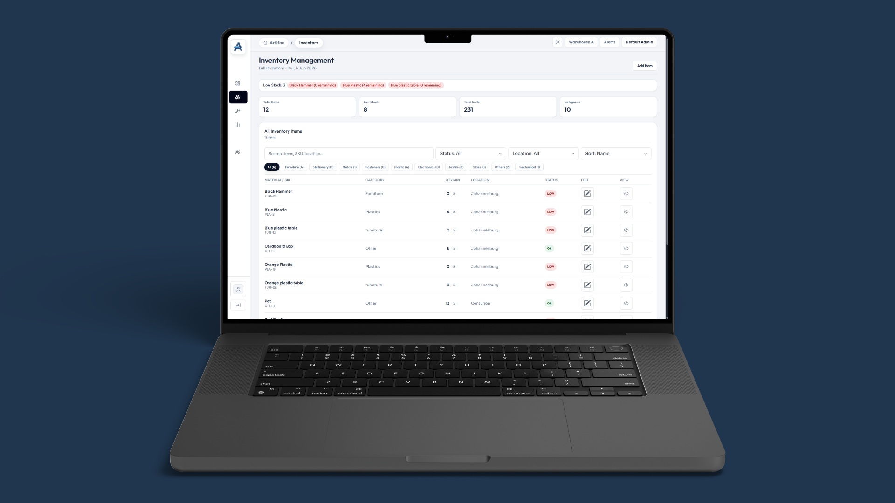
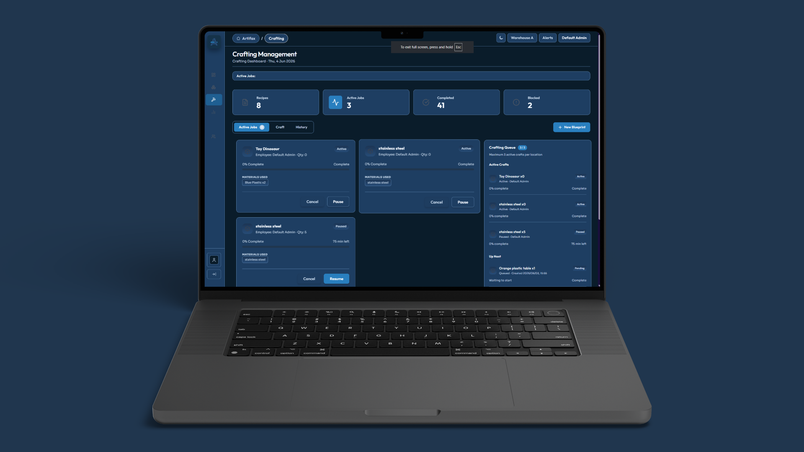
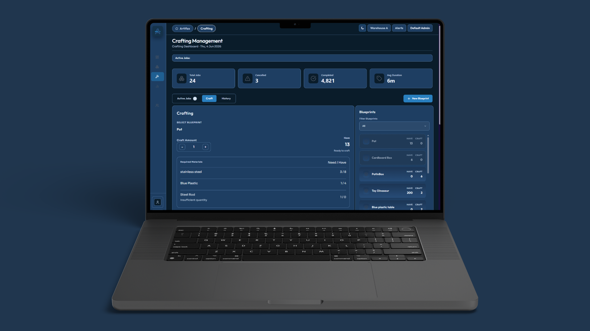
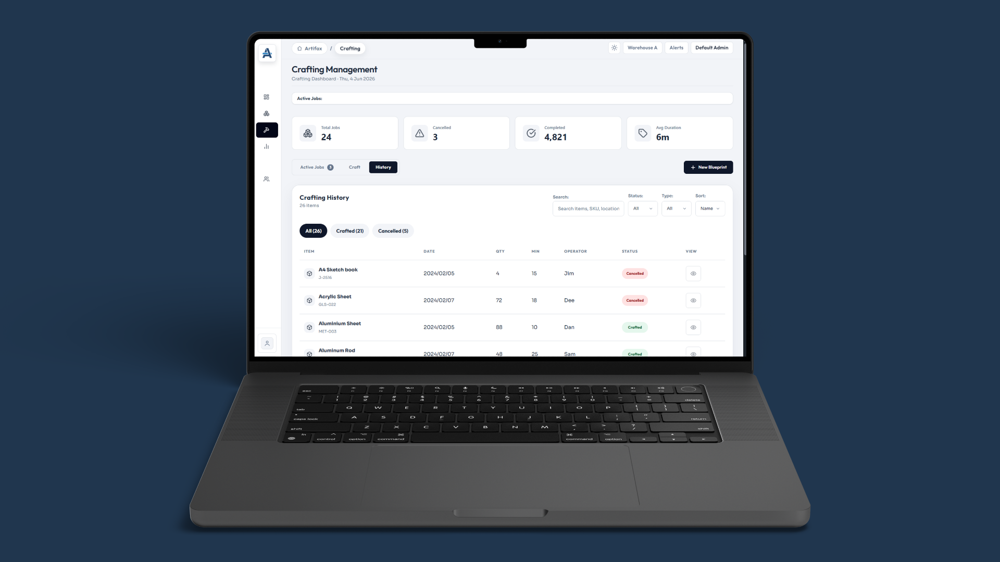
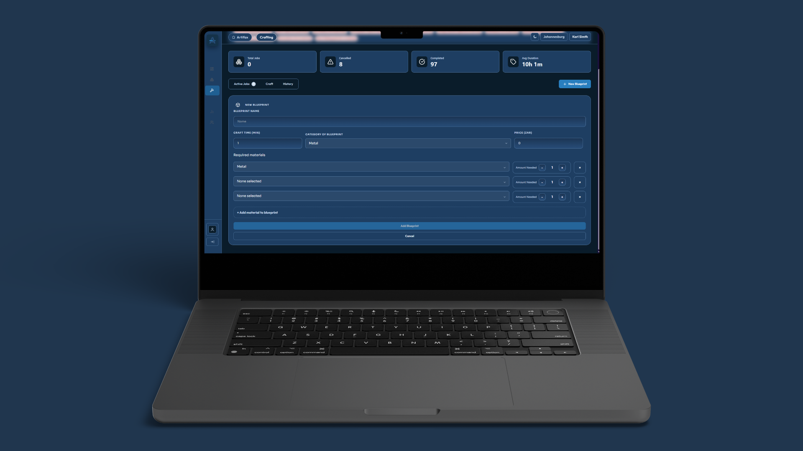
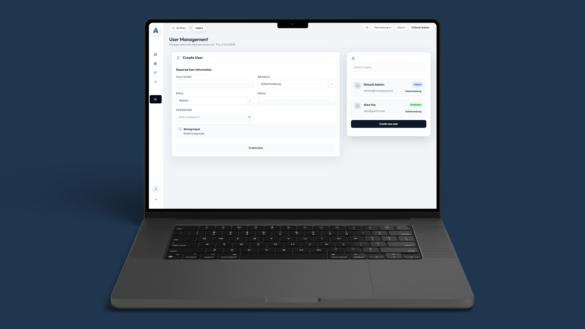

### Table Of Contents
- [Overview](#overview)
- [Installation](#installation)
- [Usage Guide](#usage-guide)
- [Additional Mockups](#additional-mockups)
- [Test Coverage](#test-coverage)
- [Technologies used](#technologies-used)
- [Acknowledgements](#acknowledgements)
## Overview

The purpose of this project report is to present the completed application for the simple and highly reliable inventory management system, Artifax. Developed to avoid unnecessary complication, the system provides a direct approach to tracking internal warehouse operations focusing entirely on internal warehouse components rather than external factors.

The core objective of the system is to deliver a highly scalable backend architecture capable of managing inventory quantities across at least two distinct locations. It enables the tracking of base materials and crafted items, manages production timelines and facilitates structured role-based access control. The system's development was guided by a distinct set of operational needs and analytical wants outlined during initial consultations.

## Installation

<table>
<tr>

### Step 1:
Go to the [Artifax Releases](https://github.com/I-Know-What-You-Committed-Last-Summer/Artifax/releases) page on GitHub and select the **latest version**.

### Step 2:
Download the **`Artifax-win32-x64.zip`** asset.

### Step 3:
Extract (unzip) the contents of the downloaded ZIP file to your preferred directory.

### Step 4:
Open the extracted folder and run **`Artifax.exe`** to launch the application.

</tr>
</table>
   
## Usage Guide

<table width="100%">
  <tr>
    <td width="50%" align="center">
      
    </td>
    <td width="50%">
      <h3>Dashboard</h3>
      
The dashboard provides users with a simplified overview of the inventory, featuring clear labels for low-stock alerts. It also displays currently active jobs and tracks orders waiting in the queue for efficient monitoring.

    </td>
  </tr>

  <tr>
    <td width="50%">
      <h3>Inventory</h3>
      
The inventory screen displays all stocked items alongside their relevant information. This ensures quick access to essential details for seamless warehouse management.

    </td>
    <td width="50%" align="center">
      
    </td>
  </tr>

  <tr>
    <td width="50%" align="center">
      
    </td>
    <td width="50%">
      <h3>Crafting: Active Jobs & Queue</h3>
      
This section displays actively crafting orders and upcoming queued items. Users can easily pause, cancel, or expedite orders to double the crafting speed as needed.

    </td>
  </tr>

  <tr>
    <td width="50%">
      <h3>Crafting: Blueprints</h3>
      
On the blueprint screen, users can select specific blueprints to review their material requirements. It also provides options to initiate a craft, edit, or delete existing blueprints from the system.

    </td>
    <td width="50%" align="center">
      
    </td>
  </tr>

  <tr>
    <td width="50%" align="center">
      
    </td>
    <td width="50%">
      <h3>Crafting: Order History</h3>
      
The order history page logs all previous crafting activities for easy reference. Users can review comprehensive details of both completed and cancelled orders from the past.

    </td>
  </tr>

  <tr>
    <td width="50%">
      <h3>New Blueprint</h3>
      
This screen allows users to seamlessly add a completely new blueprint to the system. Existing blueprints can also be edited here to ensure crafting requirements are kept up to date.

    </td>
    <td width="50%" align="center">
      
    </td>
  </tr>

  <tr>
    <td width="50%" align="center">
      
    </td>
    <td width="50%">
      <h3>Analytics (Admin Only)</h3>
      
The analytics dashboard provides administrators with valuable insights into crafted item volumes compared to their base costs. It also highlights the most frequently crafted blueprints to help managers optimise production.

    </td>
  </tr>

  <tr>
    <td width="50%">
      <h3>User Management (Admin Only)</h3>
      
Administrators can use this page to add new users or assign admin privileges. It also allows for the easy editing or deletion of current user data to maintain secure access control.

    </td>
    <td width="50%" align="center">
      
    </td>
  </tr>
</table>

## Test Coverage

### Frontend

We implemented unit and integration testing to verify our frontend code, which resulted in 17 passed and 4 failed test suites out of 21 total, and 35 passed and 4 failed individual tests out of 39 total as shown in image. The 4 failing tests belong to features that are still in production, so they are expected to fail until that development wraps up. 

As seen in image, our current code coverage metrics are 57.39% for Statements, 43.63% for Branches, 56.41% for Functions, and 57.9% for Lines, with the uncovered pages currently being fixed and refactored. For the core features that are completely finished like the components tested in BlueprintPanel.test.tsx, CraftingQueue.test.tsx, and NewBlueprint.test.tsx, the tests thoroughly check that data loads correctly from the backend, form buttons lock when inputs are missing and errors are handled safely. 

### Backend

We wrote unit tests throughout the backend on the majority of our controllers that test the functions we use on our endpoints in isolation. Our test suite was built using xUnit and we used both EF’ In-Memory Database and Moq to run our testing. Our total line coverage is only about 30%, but that number is being dropped significantly by files made by Entity Framework Core and Dotnet. We have especially high coverage on all of our controllers. We wrote 77 tests in total, all passed. Every test we wrote follows the Arrange Act Assert pattern to ensure readability and predictability. The tests primarily validated the Controllers.

This included verifying standard CRUD operations, complex relational updates, and ensuring the API returned the correct HTTP status codes for both working results and bad results. These metrics strongly reflect a robust test suite because the coverage wasn't just superficial. The tests thoroughly explored various execution paths, ensuring that our application correctly manipulates the database state (verifying item counts and property changes post-execution) and accurately maps Data Transfer Objects.

### Technologies

In terms of testing we employed a suite of technologies in order to engage in various forms of both manual and automatic. This includes:
- Jest and xUnit for automated testing of our frontend and backend applications. These two technologies were also built in additions to react and dotnet.
- Swagger and Insomnia for manual testing of backend during early to mid and later development accordingly.

## Technologies used

The following section outlines all the technologies used for development and deployment of Artifax. 

---

### Frontend Technologies

- **Node.JS** - Node.js is a powerful runtime environment that allows developers to run JavaScript on the server side, letting you build fast and scalable backend applications outside of a web browser.
- **React** - The foundational JavaScript library used for building the user interface.
- **React Router** - The standard routing library for React. It enables navigation between different pages/views in a Single Page Application (SPA) without reloading the page.
- **Axios** - A promise-based HTTP client used to send requests to backend APIs to fetch, send, or update data.
- **TailwindCSS** - Tailwind CSS is a utility-first CSS framework that allows you to build custom website designs incredibly fast by applying pre-made style classes directly inside your HTML or JSX components.
- **DaisyUI** - A popular component library plugin for Tailwind CSS. It provides ready to use components like buttons, modals, and cards so you don't have to write raw utility classes for everything.
- **PostCSS** - Build tools that work behind the scenes with Tailwind to compile your CSS and automatically add browser vendor prefixes  for cross-browser compatibility.
- **Chart.JS** - A popular JavaScript library used to render flexible, responsive charts (bar, line, pie charts, etc.).
- **Figma** - Figma is a collaborative, cloud based design tool used by product teams to create user interfaces, wireframes, and interactive prototypes for websites and mobile applications in real-time.

---

### Backend Technologies

- **ASP .Net** - .Net was the underlying technology for the establishment of the application’s backend api. It provides us with enterprise level tools that can scale with our growing needs.
    - **Entity Framework Core** - EF Core was primarily used for its ability to connect our application to our database on top of its various relationship modeling tools and migration system.
- **Postgres** - Postgres was the primary tool for creating and modelling our database as it is a highly reliable, open-source object-relational database management system.

---

### Deployment Technologies

- **GitHub Actions** - Github Actions provides us with with the ability to create workflows that to build and deploy our backend api to our Docker container.
- **Docker** - Docker packages applications and their dependencies into standardized, isolated containers. These container could then be passed along to our Render server.
- **Render** - Render is our cloud platform of choice which we used to build and deploy our api contained within our docker application.
- **Electron** - Electron is used for the deployment of the web app in the form of a sharable executable application. 

## Creators

## Acknowledgements

Lastly we would like to acknowledge the following people and resources that aided in the creation of the application:

- [Tsungai Katsuro](https://github.com/TsungaiKats)
- William Basson
- Simba Zengeni
- Stack Overflow Community
- Github Copilot
- Google Gemini
